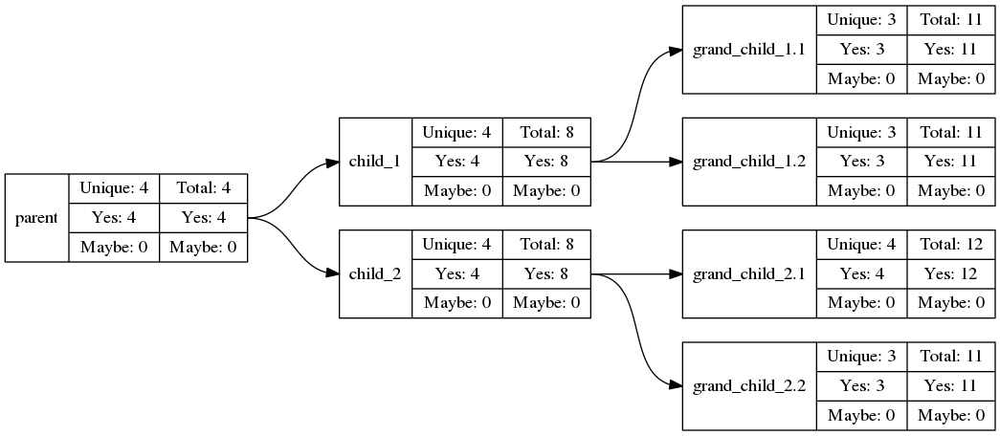

# RNA-SNPed
RNA-SNPed is a method to detect SNPs in an Experimental Design from RNA-Seq data.



To use RNA-SNPed, you must have four types of information (listed in increasing order of difficulty to obtain):
 * A reference genome (FASTA),
 * A GFF file
 * A set of FASTQ files per sample, and
 * A tree defining the "phylogeny" of your samples

## Running the RNA-SNPed pipeline

The RNA-SNPed pipeline is implemented in Snakemake, and dependencies are handled by Conda from within snakemake (these are listed in [pipeline_components/conda.yaml]).
Thus, you must only have installed conda and snakemake to make use of this pipeline.
I would even suggest installing snakemake in the root conda environment.

### Dependencies
 * (mini)conda
 * snakemake

### Running the example dataset
The example dataset can very easily be run with:

```shell
  ./RNASNPed -t 10 example/config.json
```

## Output from the RNA-SNPed pipeline
The output of the RNA-SNPed is a VCF file, and some additional summary information:

 * *`outdir`/annotated/varcall.binom.origins.deleteriousness.vcf* The VCF fiel containing variants
 * *`outdir`/summary/variants_per_node.tsv* A description of the number of variants per node
 * *`outdir`/summary/effect_counts.tsv* A summary of the effect of SNPs across the whole set (Synonymous/Missense/Nonsense)
 * *`outdir`/summary/snps_tree.pdf* A tree describing the accumulation of SNPs in the experimental design

## Running RNA-SNPed on your own dataset

In order to run your own samples, you must modify the config.json file used.
Look at the one provided in the example dataset to see the structure

### Defining your own sample tree
The challenge for running RNA-SNPed on your own dataset exists mainly in the definition of your sample tree.
If you are unsure of how the samples are related to each other, RNA-SNPed may not be the right tool for you.
For the structure of your tree, see the tree.tsv file.

### Modifying default parameters

Look at defauls.json to see the parameters that can be modified.
They names are quite self-explanatory, as they describe parameters for other tools such as STAR and PICARD. 

## **rnasnped** tool

The core of the pipeline is the varCaller tool, written in scala.
It contains four different sub-tools:
 * variantCaller, which calls SNPs from aligned BAM files,
 * assignOrigin, which determins the origin of a SNP in a sample hierarchy,
 * filterVCF, which performs various filtering operations on VCF files, and
 * slidingWindowSNPs2, to count SNPs in a sliding window
 * phaseSNPs, to phase SNPs within a gene based on the VAF

### Building rnasnped

The jar file is already provided in rnasnped/rnasnped.jar, but if you want to compile it yourself

To compile the tool, run the following command:
```shell
  cd rnasnped && ./build.sh && cd ..
```

### Usage

You can run the rnasnped tool using java
```bash
  java -jar rnasnped/rnasnped.jar <task>
```

where <task> takes the value of one of the five different tools listed above.
Additional help is available by adding help as the first parameter to the tool. e.g. `java -jar variantCaller help`

